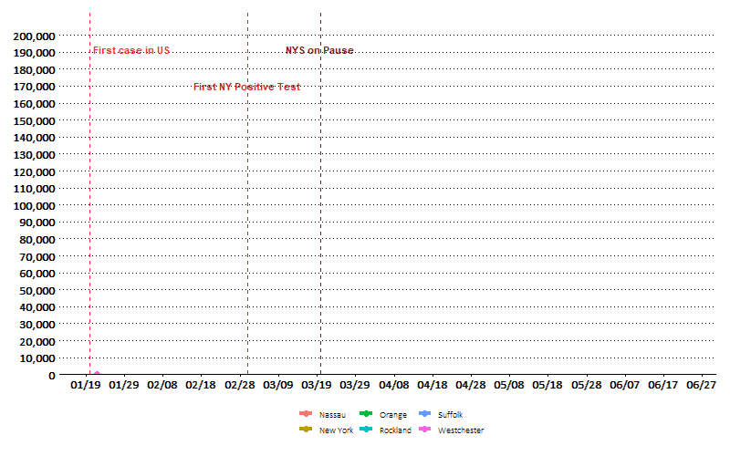

```{r, echo=FALSE}
knitr::opts_chunk$set(error = TRUE)
```


```{r, include = FALSE}
require(ggplot2)
require(reshape2)
require(gganimate)
require(gifski)
require(readxl, quietly = TRUE)
require(xlsx, quietly = TRUE)
require(dplyr)
require(cowplot, quietly = TRUE)
require(googleway, quietly = TRUE)
require(ggrepel, quietly = TRUE)
require(ggspatial, quietly = TRUE)
require(libwgeom, quietly = TRUE)
require(sf, quietly = TRUE)
require(rnaturalearth, quietly = TRUE)
require(rnaturalearthdata, quietly = TRUE)
library(leaflet)
library(maps)
library(ggthemes)
library(htmlwidgets)
library(directlabels)
library(extrafont) 
loadfonts(device = 'win')
library(DT)

setwd("C:\\Users\\CONNO\\OneDrive\\Documents\\GitHub\\COVID")

dat <- read_excel('USCOVID_TimeSeries.xlsx',sheet = 'covid')
dat.death <- read_excel('USCOVID_TimeSeries.xlsx',sheet = 'covid_deaths')

##Removes unnecessary fields
dat.death$iso2 <- NULL
dat.death$iso3 <- NULL
dat.death$code3 <- NULL
dat.death$FIPS <- NULL
dat.death$Country_Region <- NULL


dat$iso2 <- NULL
dat$iso3 <- NULL
dat$code3 <- NULL
dat$FIPS <- NULL
dat$Country_Region <- NULL 
#############################

```

```{r, include = FALSE}
### DATA TABLES ###

## US ##
#TODAY#
total <- as.numeric(unlist(dat[,ncol(dat)]))
totaldeaths <- as.numeric(unlist(dat.death[,ncol(dat.death)]))
ustotal <- sum(total)
ustotaldeaths <- sum(totaldeaths)
#YESTERDAY
total.yest <- as.numeric(unlist(dat[,ncol(dat)-1]))
totaldeaths.yest <- as.numeric(unlist(dat.death[,ncol(dat.death)-1]))
ustotal.yest <- sum(total.yest)
ustotaldeaths.yest <- sum(totaldeaths.yest)
#DELTA
newus <- ustotal - ustotal.yest
newusdeaths <- ustotaldeaths - ustotaldeaths.yest

## NEW YORK ##
#TODAY
totalny <- as.numeric(unlist(dat[dat$Province_State == 'New York',ncol(dat)]))
nytotal <- sum(totalny)
totaldeathsny <- as.numeric(unlist(dat.death[dat.death$Province_State == 'New York',ncol(dat.death)]))
nytotaldeaths <- sum(totaldeathsny)
#YESTERDAY
totalny.yest <- as.numeric(unlist(dat[dat$Province_State == 'New York',ncol(dat)-1]))
nytotal.yest <- sum(totalny.yest)
totaldeathsny.yest <- as.numeric(unlist(dat.death[dat.death$Province_State == 'New York',ncol(dat.death)-1]))
nytotaldeaths.yest <- sum(totaldeathsny.yest)
#DELTA
newny <- nytotal - nytotal.yest
newnydeaths <- nytotaldeaths - nytotaldeaths.yest

## Long Island ##
dat.ny <- dat[dat$Province_State == 'New York',]
datdeaths.ny <- dat.death[dat.death$Province_State =='New York',]
#TODAY
totalli <- as.numeric(unlist(dat.ny[dat.ny$Admin2 == 'Suffolk' | dat.ny$Admin2 == 'Nassau',ncol(dat.ny)]))
litotal <- sum(totalli)
totaldeathsli <- as.numeric(unlist(datdeaths.ny[datdeaths.ny$Admin2 == 'Suffolk' | datdeaths.ny$Admin2 == 'Nassau',ncol(datdeaths.ny)]))
litotaldeaths <- sum(totaldeathsli)
#YESTERDAY
totalli.yest <- as.numeric(unlist(dat.ny[dat.ny$Admin2 == 'Suffolk' | dat.ny$Admin2 == 'Nassau',ncol(dat.ny)-1]))
litotal.yest <- sum(totalli.yest)
totaldeathsli.yest <- as.numeric(unlist(datdeaths.ny[datdeaths.ny$Admin2 == 'Suffolk' | datdeaths.ny$Admin2 == 'Nassau',ncol(datdeaths.ny)-1]))
litotaldeaths.yest <- sum(totaldeathsli.yest)
#DELTA
newli <- litotal - litotal.yest
newlideaths <-litotaldeaths - litotaldeaths.yest

##COERCING INTO DATA FRAME ###

rnames <- c('United States','New York','Long Island')
totaltoday <- rbind(ustotal, nytotal, litotal)
totalyesterday <- rbind(ustotal.yest, nytotal.yest, litotal.yest)
totaldelta <- rbind(newus, newny, newli)
totaldeathstoday <- rbind(ustotaldeaths, nytotaldeaths, litotaldeaths)
totaldeathsyesterday <- rbind(ustotaldeaths.yest, nytotaldeaths.yest, litotaldeaths.yest)
totaldeathsdelta <- rbind(newusdeaths, newnydeaths, newlideaths)

df.frontpage <- data.frame(Cases.Today = formatC(totaltoday,format="d", big.mark=","),
                           Cases.Yesterday = formatC(totalyesterday,format="d", big.mark=","), 
                           New.Cases = formatC(totaldelta,format="d", big.mark=","), 
                           Deaths.Today = formatC(totaldeathstoday,format="d", big.mark=","), 
                           Deaths.Yesterday = formatC(totaldeathsyesterday,format="d", big.mark=","),
                           New.Deaths = formatC(totaldeathsdelta,format="d", big.mark=","))


rownames(df.frontpage) <- rnames

```

```{r, include = FALSE}
##Tidies Data##
dat.melt <- melt(dat, id.vars = c('UID','Admin2','Province_State', 'Lat','Long_','Combined_Key'))
dat.melt$date <- dat.melt$variable
dat.melt$variable <- NULL
dat.melt$value <- as.numeric(dat.melt$value)
dat.melt$date <- as.Date(dat.melt$date,"%m/%d/%y") ##Sets date to date type

dat.death.melt <- melt(dat.death, id.vars = c('UID','Admin2','Province_State', 'Lat','Long_','Combined_Key','Population'))
dat.death.melt$date <- dat.death.melt$variable
dat.death.melt$variable <- NULL
dat.death.melt$value <- as.numeric(dat.death.melt$value)
dat.death.melt$date <- as.Date(dat.death.melt$date,"%m/%d/%y")

mrdate <- max(dat.melt$date)
dat.mostrecent <- dat.melt[dat.melt$date == mrdate,]


## NEW YORK ONLY ##
dat.melt.NY <- dat.melt[dat.melt$Province_State == 'New York',] 
dat.death.melt.NY <- dat.death.melt[dat.death.melt$Province_State == 'New York',] ##Removes all other States

##Long Island Only##
dat.melt.LI <- dat.melt.NY[dat.melt.NY$Admin2 == 'Suffolk' | dat.melt.NY$Admin2 == 'Nassau',]
dat.melt.LI <-dat.melt.LI[dat.melt.LI$value > 1,] ##Ignores early months

dat.death.melt.LI <- dat.death.melt.NY[dat.death.melt.NY$Admin2 == 'Suffolk' | dat.death.melt.NY$Admin2 == 'Nassau',]

##Downstate Only##
dat.melt.DS <- dat.melt.NY[dat.melt.NY$Admin2 == 'Suffolk' | dat.melt.NY$Admin2 == 'Nassau'|dat.melt.NY$Admin2 == 'New York'|dat.melt.NY$Admin2 == 'Westchester'|dat.melt.NY$Admin2 == 'Rockland'|dat.melt.NY$Admin2 == 'Orange',]


dat.melt.DS<- dat.melt.DS[!is.na(dat.melt.DS$date),]

## DOWNSTATE ALL CASES ##

DSonly <-
  ggplot(dat.melt.DS, aes(x = date, y = value, color = Admin2, fill = Admin2))+
  geom_line(size = 1.5)+
  geom_point(size = 3)+
  geom_vline(data = NULL, xintercept = as.Date("3/20/20",'%m/%d/%y'),linetype = 'dashed', color = 'firebrick4')+
  annotate('text', x = as.Date("3/20/20",'%m/%d/%y'), y = max(dat.melt.DS$value)*9/10,label = 'NYS on Pause',
           color = 'firebrick4', fontface = c('bold'))+
  geom_vline(data = NULL, xintercept = as.Date("3/1/20",'%m/%d/%y'),linetype = 'dashed', color = 'firebrick3')+
  annotate('text', x = as.Date("3/1/20",'%m/%d/%y'), y = max(dat.melt.DS$value)*8/10,label = 'First NY Positive Test',
           color = 'firebrick3', fontface = c('bold'))+
  geom_vline(data = NULL, xintercept = as.Date("1/20/20",'%m/%d/%y'),linetype = 'dashed', color = 'firebrick1')+
  annotate('text', x = as.Date("1/20/20",'%m/%d/%y'), y = max(dat.melt.DS$value)*9/10,label = 'First case in US',
           color = 'firebrick1', fontface = c('bold'),hjust = -.05)+
  ylab('Count')+
  xlab('Date')+
  scale_y_continuous(label = scales::comma,
                     breaks = seq(from = 0, to = 200000, by = 10000),
                     expand = c(0,0))+
  scale_x_date(date_breaks = '10 days',
               date_labels = "%m/%d")+
  transition_reveal(date)+
      theme_wsj()+
      theme(plot.title = element_text(hjust = .5,
                                      size = 16,
                                      family = windowsFonts("Calibri"),
                                      face = 'bold'),
            legend.title = element_blank(),
           legend.position="bottom", legend.box = "horizontal",
            axis.text = element_text(size = 12,
                                     family = windowsFonts("Calibri Light")),
            plot.background = element_rect(fill = 'white'),
            panel.background = element_rect(fill = "white"),
            legend.background = element_rect(fill = "white"),
            legend.key = element_rect(fill = "white"),
            strip.background = element_rect(fill = 'white'),
            strip.text = element_text(family = windowsFonts("Calibri Light"),
                                      size = 14),
            text = element_text(family = windowsFonts("Calibri Light")))


dat.melt.DS.log <- dat.melt.DS
dat.melt.DS.log$value<- ifelse(dat.melt.DS$value == 0, .001,dat.melt.DS$value) ## Imputes small values so they plot
dat.melt.DS.log <- dat.melt.DS.log[!is.na(dat.melt.DS.log$date),]


## DOWNSTATE LOG CASES ##

DSonlylog <-
  ggplot(dat.melt.DS.log, aes(x = date, y = value, color = Admin2, fill = Admin2))+
  geom_line(size = 1.5)+
  geom_point(size = 3)+
  geom_vline(data = NULL, xintercept = as.Date("3/20/20",'%m/%d/%y'),linetype = 'dashed', color = 'firebrick4')+
  annotate('text', x = as.Date("3/20/20",'%m/%d/%y'), y = max(dat.melt.DS$value)*7/10,label = 'NYS on Pause',
           color = 'firebrick4', fontface = c('bold'))+
  geom_vline(data = NULL, xintercept = as.Date("3/1/20",'%m/%d/%y'),linetype = 'dashed', color = 'firebrick3')+
  annotate('text', x = as.Date("3/1/20",'%m/%d/%y'), y = max(dat.melt.DS$value)*1/10,label = 'First NY Positive Test',
           color = 'firebrick3', fontface = c('bold'))+
  geom_vline(data = NULL, xintercept = as.Date("1/20/20",'%m/%d/%y'),linetype = 'dashed', color = 'firebrick1')+
  annotate('text', x = as.Date("1/20/20",'%m/%d/%y'), y = max(dat.melt.DS$value)*7/10,label = 'First case in US',
           color = 'firebrick1', fontface = c('bold'),hjust = -.05)+
  ggtitle('Down State New York Log Cases')+
  ylab('Log(Count)')+
  xlab('Date')+
  transition_reveal(date)+
  scale_y_log10(expand = c(0,0))+
  scale_x_date(date_breaks = '10 days',
               date_labels = "%m/%d")+
      theme_wsj()+
      theme(plot.title = element_text(hjust = .5,
                                      size = 16,
                                      family = windowsFonts("Calibri"),
                                      face = 'bold'),
            legend.title = element_blank(),
           legend.position="bottom", legend.box = "horizontal",
            axis.text = element_text(size = 12,
                                     family = windowsFonts("Calibri Light")),
            plot.background = element_rect(fill = 'white'),
            panel.background = element_rect(fill = "white"),
            legend.background = element_rect(fill = "white"),
            legend.key = element_rect(fill = "white"),
            strip.background = element_rect(fill = 'white'),
            strip.text = element_text(family = windowsFonts("Calibri Light"),
                                      size = 14),
            text = element_text(family = windowsFonts("Calibri Light")))


## Adding Rate Growth to Downstate Data
RateGrowthDS <- dat.melt.DS %>%
  group_by(Admin2) %>%
  mutate(Diff_growth = value - lag(value),
         Rate_growth = Diff_growth/lag(value)*100)

RateGrowthDeath.LI <-
  dat.death.melt.LI %>%
  group_by(Admin2) %>%
  mutate(Diff_growth = value - lag(value),
         Rate_growth = Diff_growth/lag(value)*100)

RateGrowthDeath.LI <-
  RateGrowthDeath.LI  %>%
  group_by(Admin2) %>%
  mutate(Rate_growth_7day = (Rate_growth + lag(Rate_growth) + lag(Rate_growth,2)+
                               lag(Rate_growth,3)+lag(Rate_growth,4)+
                               lag(Rate_growth,5) + lag(Rate_growth,6))/7)

RateGrowthDeath.LI <- RateGrowthDeath.LI %>%
  group_by(Admin2) %>%
  mutate(Diff_growth_7day = (Diff_growth + lag(Diff_growth) + lag(Diff_growth,2)+
                               lag(Diff_growth,3)+lag(Diff_growth,4)+
                               lag(Diff_growth,5) + lag(Diff_growth,6))/7)


RateGrowthDeath.LI <- RateGrowthDeath.LI[RateGrowthDeath.LI$value > 0,]


## 3 DAY MOVING AVERAGE ##
RateGrowthDS <- RateGrowthDS %>%
  group_by(Admin2) %>%
  mutate(Rate_growth_3day = (Rate_growth + lag(Rate_growth) + lag(Rate_growth,2))/3)

LongIsland <- c('Nassau', 'Suffolk')

##7-DAY MOVING AVERAGE ##
RateGrowthDS <- RateGrowthDS %>%
  group_by(Admin2) %>%
  mutate(Rate_growth_7day = (Rate_growth + lag(Rate_growth) + lag(Rate_growth,2)+
                               lag(Rate_growth,3)+lag(Rate_growth,4)+
                               lag(Rate_growth,5) + lag(Rate_growth,6))/7)

RateGrowthDS <- RateGrowthDS %>%
  group_by(Admin2) %>%
  mutate(Diff_growth_7day = (Diff_growth + lag(Diff_growth) + lag(Diff_growth,2)+
                               lag(Diff_growth,3)+lag(Diff_growth,4)+
                               lag(Diff_growth,5) + lag(Diff_growth,6))/7)


RateGrowthDS <- filter(RateGrowthDS, value > 0 & Admin2 %in% LongIsland) ## Only Long Island 


RateGrowthDS$rg.lim <- ifelse(RateGrowthDS$Rate_growth> 100, 100, RateGrowthDS$Rate_growth) ## Growth Limited at 100 for Plotting Purposes

##STATIC CHART
LIOnlyRGstatic <-
  ggplot(RateGrowthDS, aes(x = date, y = rg.lim/100, fill = Admin2)) + geom_tile(aes(height = rg.lim/100, y = rg.lim/100/2, width = .9), alpha = .9, position='dodge')+
  scale_x_date(date_breaks = '3 days',
               date_labels = "%m/%d")+
  scale_y_continuous(label = scales::percent,
                     breaks = seq(from = 0, to = 10000, by = .1),
                     limits = c(0,1),
                     expand = c(0,0))+
  geom_vline(data = NULL, xintercept = as.Date("3/20/20",'%m/%d/%y'),linetype = 'dashed', color = 'firebrick4')+
  facet_wrap(.~Admin2, ncol = 1)+
  annotate('text', x = as.Date("3/20/20",'%m/%d/%y'), y = .1,label = 'NYS on Pause',
           color = 'firebrick4', fontface = c('bold'))+
  labs(title='Day-by-day Confirmed Case Growth Rate -- Long Island Only') +
  ylab('% Increase in Confirmed Cases')+
  xlab('Date')+
      theme_wsj()+
      theme(plot.title = element_text(hjust = .5,
                                      size = 16,
                                      family = windowsFonts("Calibri"),
                                      face = 'bold'),
            legend.title = element_blank(),
            legend.position = 'None',
            axis.text = element_text(size = 12,
                                     family = windowsFonts("Calibri Light")),
            plot.background = element_rect(fill = 'white'),
            panel.background = element_rect(fill = "white"),
            legend.background = element_rect(fill = "white"),
            strip.background = element_rect(fill = 'white'),
            strip.text = element_text(family = windowsFonts("Calibri Light"),
                                      size = 14),
            text = element_text(family = windowsFonts("Calibri Light")))


##Rate Growth Static -- Death##
LIonlyRGstaticdeath <-
  ggplot(RateGrowthDeath.LI, aes(x = date, y = Rate_growth/100, fill = Admin2, color = Admin2))+
  geom_bar(stat='identity', position = 'dodge')+
  scale_x_date(date_breaks = '3 days',
               date_labels = "%m/%d")+
  facet_wrap(.~Admin2, ncol = 1)+
  scale_y_continuous(label = scales::percent,
                     expand = c(0,0))+
  geom_vline(data = NULL, xintercept = as.Date("3/20/20",'%m/%d/%y'),linetype = 'dashed', color = 'firebrick4')+
  annotate('text', x = as.Date("3/20/20",'%m/%d/%y'), y = 1.5,label = 'NYS on Pause',
           color = 'firebrick4', fontface = c('bold'))+
  labs(title='Day-by-day Death Growth Rate -- Long Island Only') +
  ylab('% Increase in Deaths')+
  xlab('Date')+
      theme_wsj()+
      theme(plot.title = element_text(hjust = .5,
                                      size = 16,
                                      family = windowsFonts("Calibri"),
                                      face = 'bold'),
            legend.title = element_blank(),
            legend.position = 'None',
            axis.text = element_text(size = 12,
                                     family = windowsFonts("Calibri Light")),
            plot.background = element_rect(fill = 'white'),
            panel.background = element_rect(fill = "white"),
            legend.background = element_rect(fill = "white"),
            strip.background = element_rect(fill = 'white'),
            strip.text = element_text(family = windowsFonts("Calibri Light"),
                                      size = 14),
            text = element_text(family = windowsFonts("Calibri Light")))

##7 Day MA##

LIonlyRG7day <- 
    ggplot(RateGrowthDS, aes(x = date, y = Rate_growth_7day/100, color = Admin2, fill = Admin2))+
      geom_point(aes(x = date, y = Rate_growth/100, color = Admin2, fill = Admin2),alpha = 1)+
      geom_bar(stat = 'identity', alpha = .4)+
      geom_text(aes(label = paste0(round(Rate_growth_7day,0),"%")), color = 'black', size = 3, vjust = -.5)+
      facet_wrap(~Admin2,
                 ncol = 1)+
      geom_vline(data = NULL, xintercept = as.Date("3/20/20",'%m/%d/%y'),linetype = 'dashed', color = 'firebrick4')+
      scale_x_date(date_breaks = '3 days',
                   date_labels = "%m/%d")+
      scale_y_continuous(label = scales::percent,
                         expand = c(0,0),
                         limits = c(0,1))+
      annotate('text', x = as.Date("3/20/20",'%m/%d/%y'), y = .9,label = 'NYS on Pause',
               color = 'firebrick4', fontface = c('bold'))+
      labs(title='7-Day Moving Average Reported Confirmed Cases -- Long Island Only') +
      ylab('% Increase in Cases - 7 day average')+
      xlab('Date')+
      theme_wsj()+
      theme(plot.title = element_text(hjust = .5,
                                      size = 16,
                                      family = windowsFonts("Calibri"),
                                      face = 'bold'),
            legend.title = element_blank(),
            legend.position = 'None',
            axis.text = element_text(size = 12,
                                     family = windowsFonts("Calibri Light")),
            plot.background = element_rect(fill = 'white'),
            panel.background = element_rect(fill = "white"),
            legend.background = element_rect(fill = "white"),
            strip.background = element_rect(fill = 'white'),
            strip.text = element_text(family = windowsFonts("Calibri Light"),
                                      size = 14),
            text = element_text(family = windowsFonts("Calibri Light")))


### 7-day RG of Deaths ##################################################
LIonlydeathRG7day <- 
    ggplot(RateGrowthDeath.LI, aes(x = date, y = Rate_growth_7day/100, color = Admin2, fill = Admin2))+
      geom_point(aes(x = date, y = Rate_growth/100, color = Admin2, fill = Admin2),alpha = 1)+
      geom_bar(stat = 'identity', alpha = .4)+
      geom_text(aes(label = paste0(round(Rate_growth_7day,0),"%")), color = 'black', size = 3.5, vjust = -.5)+
      facet_wrap(~Admin2,
                 ncol = 1)+
      geom_vline(data = NULL, xintercept = as.Date("3/20/20",'%m/%d/%y'),linetype = 'dashed', color = 'firebrick4')+
      scale_x_date(date_breaks = '3 days',
                   date_labels = "%m/%d")+
      scale_y_continuous(label = scales::percent,
                         expand = c(0,0),
                         limits = c(0,1))+
      annotate('text', x = as.Date("3/20/20",'%m/%d/%y'), y = .9,label = 'NYS on Pause',
               color = 'firebrick4', fontface = c('bold'))+
      labs(title='7-Day Moving Average Reported Deaths per Day -- Long Island Only') +
      ylab('% Increase in Cases - 7 day average')+
      xlab('Date')+
      theme_wsj()+
      theme(plot.title = element_text(hjust = .5,
                                      size = 16,
                                      family = windowsFonts("Calibri"),
                                      face = 'bold'),
            legend.title = element_blank(),
            legend.position = 'None',
            axis.text = element_text(size = 12,
                                     family = windowsFonts("Calibri Light")),
            plot.background = element_rect(fill = 'white'),
            panel.background = element_rect(fill = "white"),
            legend.background = element_rect(fill = "white"),
            strip.background = element_rect(fill = 'white'),
            strip.text = element_text(family = windowsFonts("Calibri Light"),
                                      size = 14),
            text = element_text(family = windowsFonts("Calibri Light")))

########################################################################

###Individual Cases and 7 day average###################################
IC7 <- ggplot(RateGrowthDS, aes(x = date, y = Diff_growth, color = Admin2, fill=Admin2))+
  geom_bar(stat = 'identity',alpha = .7)+
  geom_line(aes(x = date, y = Diff_growth_7day, color = Admin2), alpha = 1, size = 2)+
  facet_wrap(~Admin2,
             ncol = 1)+
  geom_vline(data = NULL, xintercept = as.Date("3/20/20",'%m/%d/%y'),linetype = 'dashed', 
             color = 'firebrick4')+
  scale_x_date(date_breaks = '3 days',
                   date_labels = "%m/%d")+
  scale_y_continuous(label = scales::comma,
                         expand = c(0,0))+
        annotate('text', x = as.Date("3/20/20",'%m/%d/%y'), y = 1000,label = 'NYS on Pause',
               color = 'firebrick4', fontface = c('bold'))+
  ylab('New Cases')+
  xlab('Date')+
  labs(title = 'New Individual Cases Reported per Day')+
      theme_wsj()+
      theme(plot.title = element_text(hjust = .5,
                                      size = 16,
                                      family = windowsFonts("Calibri"),
                                      face = 'bold'),
            legend.title = element_blank(),
            legend.position = 'None',
            axis.text = element_text(size = 12,
                                     family = windowsFonts("Calibri Light")),
            plot.background = element_rect(fill = 'white'),
            panel.background = element_rect(fill = "white"),
            legend.background = element_rect(fill = "white"),
            strip.background = element_rect(fill = 'white'),
            strip.text = element_text(family = windowsFonts("Calibri Light"),
                                      size = 14),
            text = element_text(family = windowsFonts("Calibri Light")))


########################################################################
ICDeath7 <-
  ggplot(RateGrowthDeath.LI, aes(x = date, y = Diff_growth, color = Admin2, fill=Admin2))+
  geom_bar(stat = 'identity',alpha = .7)+
  geom_line(aes(x = date, y = Diff_growth_7day, color = Admin2), alpha = 1, size = 2)+
  facet_wrap(~Admin2,
             ncol = 1)+
  geom_vline(data = NULL, xintercept = as.Date("3/20/20",'%m/%d/%y'),linetype = 'dashed', 
             color = 'firebrick4')+
  
  scale_x_date(date_breaks = '3 days',
                   date_labels = "%m/%d")+
  scale_y_continuous(label = scales::comma,
                         expand = c(0,0))+
        annotate('text', x = as.Date("3/20/20",'%m/%d/%y'), y = 100,label = 'NYS on Pause',
               color = 'firebrick4', fontface = c('bold'))+
  ylab('New Cases')+
  xlab('Date')+
  labs(title = 'New Individual Deaths Reported per Day')+
      theme_wsj()+
      theme(plot.title = element_text(hjust = .5,
                                      size = 16,
                                      family = windowsFonts("Calibri"),
                                      face = 'bold'),
            legend.title = element_blank(),
            legend.position = 'None',
            axis.text = element_text(size = 12,
                                     family = windowsFonts("Calibri Light")),
            plot.background = element_rect(fill = 'white'),
            panel.background = element_rect(fill = "white"),
            legend.background = element_rect(fill = "white"),
            strip.background = element_rect(fill = 'white'),
            strip.text = element_text(family = windowsFonts("Calibri Light"),
                                      size = 14),
            text = element_text(family = windowsFonts("Calibri Light")))

```

# Data
```{r, echo = FALSE, results='asis',message = FALSE, warning = FALSE, fig.width=12, fig.height=8}
library(knitr)
library('kableExtra')
thistable <- 
  kable(df.frontpage,
      col.names = gsub("[.]", " ", names(df.frontpage)),
      align = "cccc", 
      table.attr = "class=\"striped\"", 
      format = "html") %>%
  kable_styling(bootstrap_options = c("striped", "hover"))

show(thistable)
```


# Downstate New York

In absolute terms, New York City cases have well outpaced the rest of downstate New York:

```{r, echo = FALSE,message = FALSE, warning = FALSE, results = FALSE}
#anim_save("DSonly.gif", DSonly)
animate(DSonly, width = 800, height = 500)
anim_save("DSonly.gif")
```





The NYS on Pause measure appears to have been effective at slowing the growth rate of the virus, illustrated by a bending curve when viewing the same data on a log scale. 

```{r, echo = FALSE, message = FALSE, warning = FALSE, results = FALSE, fig.width=12}

#anim_save("DSonlylog.gif", DSonlylog)
animate(DSonlylog, width = 800, height = 500)
anim_save("DSonlylog.gif")
```


# Long Island 


```{r, echo = FALSE, fig.width=12, fig.height=8}

suppressWarnings(plot(LIOnlyRGstatic))

```

Deaths have also been increasing at a slower pace due to social distancing measures, though the effect on COVID outcomes (i.e., hospitalizations and deaths) is lagged considerably more than confirmed cases. 

```{r, echo = FALSE, fig.width=12, fig.height=8}

suppressWarnings(plot(LIonlyRGstaticdeath))

```

The 7-day moving average further illustrates the decline in growth of cases. 


These four charts represent the growth of cases and deaths for each county:

```{r, echo = FALSE, fig.width=12, fig.height=8}

suppressWarnings(plot(LIonlyRG7day))
suppressWarnings(plot(LIonlydeathRG7day))


```


These four charts represent the absolute number cases and deaths per day for each county. The line represents the 7-day moving average, which smooths out data irregularities:

```{r, echo = FALSE, fig.width=12, fig.height=8}
suppressWarnings(plot(IC7))
suppressWarnings(plot(ICDeath7))

```